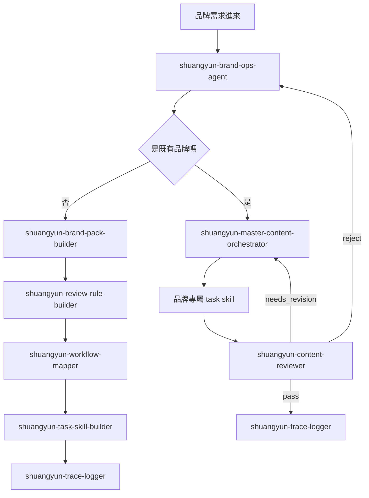

# 双云 Skill OS（8 顆核心 Skill 子系統）

> **狀態**：✅ 已建（v1.0 / 2026-03-20）
> 來源：`06_Skills/双云_Skill_OS/`（含總索引、串接流程圖、全流程文件、8 個 SKILL.md）

> 双云目前 8 顆核心 Skill 的整合運作系統。設計目標：**人只對前台 agent 說需求，不手打多段 prompt**；agent 自動分類、路由、調用 skill、回報下一步；只有例外、退件、缺資料、人工批准時才把人拉進來。

---

## 三層架構

### 1. 前台入口（1 顆）

| Skill | 角色 |
|---|---|
| `shuangyun-brand-ops-agent` | 品牌端**唯一入口**。負責接收需求、分類任務、標準化 brief、決定要走哪條流程 |

### 2. 共用骨幹（4 顆）

| Skill | 角色 |
|---|---|
| `shuangyun-brand-pack-builder` | 把新品牌或資料不足的品牌整理成可用 brand pack |
| `shuangyun-content-reviewer` | 統一審稿節點，判定 `pass` / `needs_revision` / `reject` |
| `shuangyun-trace-logger` | 留下 workflow 證據鏈，記錄 brief、版本、審稿、退件、最終狀態 |
| `shuangyun-master-content-orchestrator` | **控制塔**。把 intake、brand control、production、review、revision、logging 串成一條完整流程 |

### 3. Builder 層（3 顆）

| Skill | 角色 |
|---|---|
| `shuangyun-task-skill-builder` | 把重複任務變成 task skill，並判斷要不要拆成主 skill + sub skill |
| `shuangyun-review-rule-builder` | 把品牌要求和失敗案例轉成可重用 review rules |
| `shuangyun-workflow-mapper` | 把週任務、月任務、onboarding、審核流程畫成 AI First workflow |

---

## 完整串接流程圖



---

## 4 種使用情境

### 1. 新品牌導入

```
brand-ops-agent → brand-pack-builder → review-rule-builder
→ workflow-mapper → task-skill-builder → trace-logger
```

**輸出**：brand pack、review rules、workflow map、brand-specific task skills、onboarding trace log

### 2. 每週品牌內容需求

```
brand-ops-agent → master-content-orchestrator → 品牌專屬 task skill
→ content-reviewer → (pass) trace-logger
                  → (needs_revision) 回 orchestrator
```

**輸出**：可發布內容、reviewer 結論、trace log

### 3. 每月分析與下月規劃

```
brand-ops-agent → master-content-orchestrator → 品牌專屬 monthly/report task skill
→ content-reviewer → trace-logger
```

**輸出**：月報初稿與定稿、下月建議、review result、monthly trace log

### 4. 流程優化或新 task 建置

```
workflow-mapper → review-rule-builder → task-skill-builder
→ master-content-orchestrator → trace-logger
```

**輸出**：更新後 workflow、新 review rules、新 task skill 草案、版本變更紀錄

---

## 誰直接使用哪一顆

| 角色 | 主要 Skill |
|---|---|
| 品牌端窗口 | 只碰 `shuangyun-brand-ops-agent` |
| 內容營運／PM | 主要看 `shuangyun-master-content-orchestrator` |
| 審稿／品質管理 | 主要看 `shuangyun-content-reviewer` |
| 制度設計／新品牌導入 | 主要看 3 顆 builder skills |
| 教學與追蹤 | 查看 `shuangyun-trace-logger` |

---

## 8 顆 Skill 個別定位（簡述）

### shuangyun-brand-ops-agent（前台入口）

> Single front-door agent for brand-side work. 接收品牌需求 → 分類為 weekly / monthly analysis / review / onboarding / workflow update → 路由到正確流程，**不讓 operator 手選 skill**。

### shuangyun-brand-pack-builder（Builder）

> Build the first-pass brand pack. 從網站、品牌介紹、範例貼文、產品資訊建立第一版 brand pack（tone guide、forbidden-word rules、CTA style、channel rules、review baseline）供下游 brand-control 與 review skills 使用。

### shuangyun-content-reviewer（共用骨幹）

> Unified review gate。判定 `pass` / `needs_revision` / `reject`，依 `structure` / `brand` / `compliance` / `final` 模式審稿。**所有 publishable output 必須經過此節點。**

### shuangyun-master-content-orchestrator（控制塔）

> Coordinate the workflow. **Do not become the workflow.** 跨 intake、brand control、task routing、review、revision、trace logging 協調，**不讓 operator 手選每個 skill**。

### shuangyun-trace-logger（共用骨幹）

> Record the workflow, not just the final output. 至少要出現在這些點：
>
> 1. brief 標準化完成後
> 2. first draft 產出後
> 3. reviewer 判定後
> 4. revision round 完成後
> 5. 最終 pass 或 reject 後
> 6. onboarding 規則建立後
> 7. workflow 版本更新後

### shuangyun-task-skill-builder（Builder）

> Build a task skill, not just a one-off answer. 從 brand pack + 任務定義 + 範例 + review rules，產出結構化 skill 草案，並決定是「單一 skill」還是「主 + sub skill」架構。

### shuangyun-review-rule-builder（Builder）

> Build review logic, not review output. 把品牌期望、失敗案例、好壞範例轉成可重用的 review criteria，給 reviewers / orchestrators / audit logs 共用。

### shuangyun-workflow-mapper（Builder）

> Build the workflow map before building more prompts. 把每週、每月、onboarding、審批工作翻譯為明確 nodes、handoffs、review checkpoints、logging 需求，讓 Shuangyun 系統能自動化。

---

## 核心原則

1. 前台只保留**一個入口**，不讓團隊自己想 prompt
2. 共用骨幹負責**穩定流程**，不承擔品牌個性
3. 品牌差異放在 **brand pack 和品牌專屬 task skill**
4. 所有 **publishable output 必須經過 reviewer 與 trace logger**

## AI First 操作原則

- 人只碰**入口 agent**，不自己想 skill 名稱
- agent 自動判斷流程與下游 skill
- builder skills 負責建立**制度**，不負責替代正式生產流程
- 所有關鍵節點都要留 trace

---

## 相關連結

- 三層架構詳解 → [Week 4 §模組 7.5](../courses/Week4串.md)
- 命名規範（三段式） → [skills index](index.md)
- API Gateway（基礎設施層協作） → [API調度總機.md](API調度總機.md)
